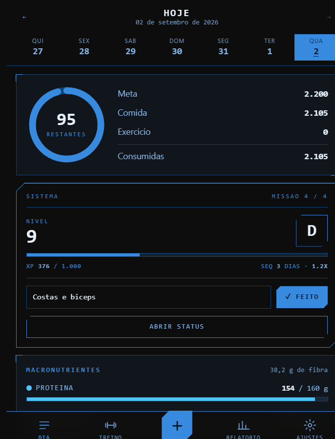
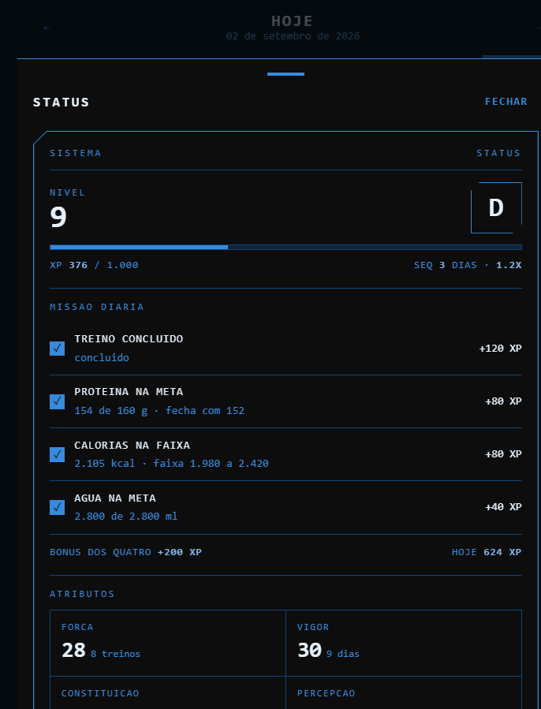
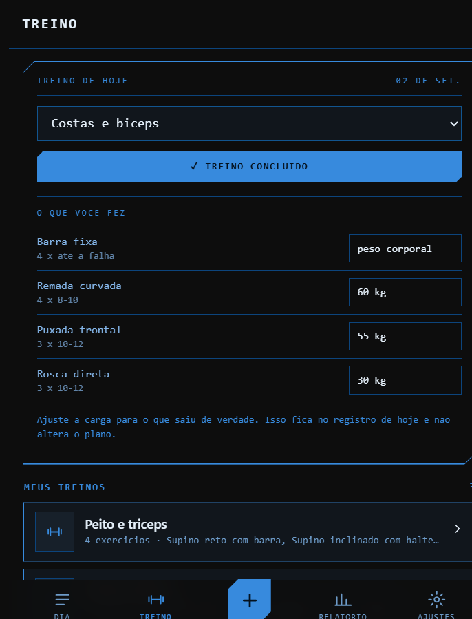
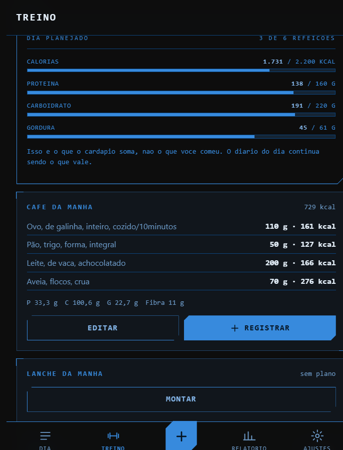
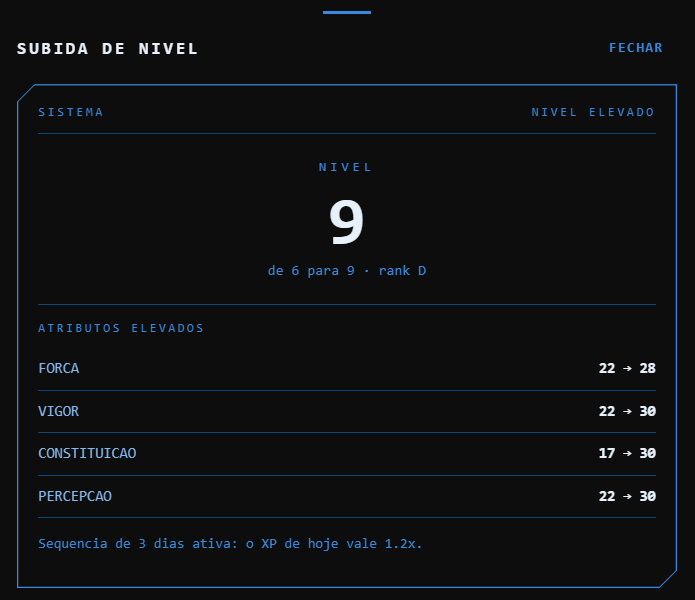

# Diário Alimentar

Diário de alimentação, treino e dieta pessoal, com uma camada de jogo por cima no
estilo Solo Leveling. Você **descreve ou fotografa** a refeição e o app quebra em
ingredientes, estima as porções e soma calorias, macros e micronutrientes; registra o
treino do dia a partir dos planos que você monta; e planeja o cardápio de cada refeição
para registrar em um toque.

A diferença principal em relação ao original: **o modelo não calcula nada.** Ele só
identifica o alimento, estima a quantidade em gramas e aponta a linha correspondente na
tabela TACO. Os números vêm da TACO e toda a aritmética acontece no dispositivo — então
a mesma comida sempre dá o mesmo resultado, e remover um ingrediente altera o total
exatamente pelo que aquele ingrediente valia.

Roda inteiro no navegador. Nenhum servidor, nenhuma conta, nenhuma assinatura.

---

## Como é

| | |
|---|---|
|  |  |
| **Dia** &mdash; o anel de calorias, o cartão do Sistema e os macros. | **Status** &mdash; a missão do dia, com o número real de cada objetivo. |
|  |  |
| **Treino** &mdash; o check-in de hoje e os planos que você monta. | **Dieta** &mdash; o cardápio de cada refeição, que vira registro em um toque. |

<p align="center">
  <br>
  <em>A subida de nível, quando os registros do dia elevam o nível.</em>
</p>

---

## Como colocar pra rodar

Você precisa do [Node.js](https://nodejs.org) instalado (só para servir os arquivos).

```bash
node serve.mjs
```

Abra `http://localhost:5173`. Na primeira vez o app pede seu perfil e calcula as metas.

## No ar (Vercel)

**https://diario-alimentar-equipe-gust.vercel.app**

Essa URL é estável — não muda a cada deploy. Abra no celular e use "Adicionar à tela de
início" para instalar como aplicativo; ele passa a abrir offline.

Publicar é seguro: **a chave da API não está no código.** Ela fica no IndexedDB do seu
navegador, e você a digita em Ajustes no próprio celular. O site publicado é uma casca
vazia para qualquer pessoa que não tenha a própria chave.

### Publicar de novo depois de mexer no código

```bash
npx vercel deploy --prod --scope equipe-gust
```

O `--scope` é necessário: sem ele o CLI cai no escopo pessoal e o deploy falha com
`Not authorized`, porque o projeto vive no time. O vínculo fica em `.vercel/`, que **não
está no repositório** — num clone novo, rode `npx vercel link --scope equipe-gust` antes
do primeiro deploy.

`vercel.json` cuida dos cabeçalhos — o mais importante deles impede que o `sw.js` fique
preso em cache, senão o app travaria numa versão antiga. `.vercelignore` mantém fora da
produção os CSVs de origem, os scripts de `tools/`, as capturas de tela e o `serve.mjs`,
que só servem para desenvolvimento.

> A proteção de deployment (Vercel Authentication) está **desligada** neste projeto — sem
> isso o service worker e o manifest seriam redirecionados para a tela de login da Vercel
> e o PWA não instalaria.

### Rodar no celular sem publicar

Rode `node serve.mjs` no computador e abra no celular o endereço `http://SEU-IP:5173` que
o comando imprime. Funciona, mas fora de HTTPS o navegador não instala PWA nem guarda offline.

### Chave da API

Pegue uma gratuita em [aistudio.google.com/apikey](https://aistudio.google.com/apikey) e
cole em **Ajustes → Inteligência artificial**. Depois toque em **Buscar** para listar os
modelos que a sua chave aceita e escolher um (o padrão é `gemini-2.5-flash`).

Sem chave o app continua funcionando: dá para registrar tudo pela busca manual na TACO,
água e peso. Só o registro por texto/foto exige a API.

**Custo:** o tier gratuito do Gemini costuma cobrir folgadamente um uso pessoal. Mesmo
pagando, cada análise de foto custa em torno de US$ 0,003 a 0,015 — algo como US$ 1–2 por
mês registrando cinco refeições por dia.

---

## Como funciona por dentro

```
você escreve ou fotografa
        ↓
js/gemini.js  →  Gemini (structured output, JSON Schema)
        ↓        prompt inclui o índice completo da TACO (591 alimentos)
        ↓        e proíbe o modelo de somar qualquer coisa
   [{ nome, gramas, taco_id, confianca_taco }, ...]
        ↓
js/nutri.js   →  resolverItem(): TACO indicada pelo modelo
        ↓                        > TACO por busca local
        ↓                        > estimativa do modelo (último recurso)
        ↓
   tela de revisão — você confere, edita gramas, troca ou remove itens
        ↓        (recalcula localmente, sem nova chamada de API)
        ↓
js/db.js      →  IndexedDB
```

Cada item registrado guarda de onde vieram os números: a etiqueta **TACO** (verde) ou
**estimado** (cinza) aparece na revisão. Micronutrientes só são somados sobre os itens que
vieram da TACO — o app não finge precisão que não tem.

### Arquivos

| Arquivo | Papel |
|---|---|
| `index.html`, `style.css` | casca e design system (tokens do Sistema, tema único) |
| `js/app.js` | inicialização, cabeçalho, navegação, roteamento |
| `js/estado.js` | perfil, metas e preferências |
| `js/db.js` | IndexedDB — entradas, pesos, favoritos, treino, planos, cardápio, backup |
| `js/taco.js` | carga e busca da tabela nutricional |
| `js/nutri.js` | TDEE, metas, resolução de itens e **todas as somas** |
| `js/gemini.js` | chamada à API, schema, compressão de imagem |
| `js/sistema.js` | XP, sequência, atributos, nível e rank — funções puras |
| `js/ui.js` | helpers de render, folhas empilháveis, gráficos SVG |
| `js/views/*.js` | as telas e os painéis do Sistema |
| `js/views/treino.js` | planos de treino, check-in do dia e a montagem pela IA |
| `js/views/dieta.js` | cardápio por refeição |
| `data/taco.json` | 597 alimentos, valores por 100 g |
| `sw.js` | service worker (abre offline) |
| `serve.mjs` | servidor estático local |
| `tools/build-taco.mjs` | regenera `data/taco.json` a partir dos CSVs |
| `tools/build-icones.mjs` | regenera os ícones PNG |

`data/taco-indice.txt` é o texto exato que vai no prompt — útil para conferir o que o
modelo enxerga.

---

## Telas

- **Dia** — anel de calorias, barras de macro, micronutrientes, água e os registros
  agrupados por refeição. Toque em qualquer registro para editar ou excluir. O cartão do
  Sistema mostra nível, rank e o check-in do treino, e abre o painel de status.
- **Treino** — o check-in de hoje, os planos que você monta (Peito e tríceps, Costas,
  Pernas…) com série, repetição e carga, a montagem pela IA e o cardápio da dieta.
- **Relatório** — calorias por dia em 7/14/30 dias contra a meta, médias do período,
  dias dentro da meta, visão em tabela, um resumo copiável (para mandar ao
  nutricionista, por exemplo) e a evolução do peso.
- **Ajustes** — perfil, metas (automáticas ou manuais), chave da API e backup.

---

## O Sistema

Uma camada de jogo sobre os dados que o app já coleta, no estilo das janelas de Sistema do
Solo Leveling. **Nenhum número dela é inventado e nenhum é guardado:** XP, sequência,
atributos, nível e rank são função pura do histórico, recalculados do zero toda vez que a
tela abre. Por isso corrigir uma refeição de junho corrige o nível junto, e por isso o
backup não carrega XP nenhum — ele carrega os fatos, e os fatos bastam.

**Missão diária**, quatro objetivos independentes avaliados contra as metas:

| Objetivo | XP | Fecha quando |
|---|---|---|
| Treino concluído | 120 | você marca o check-in do dia |
| Proteína na meta | 80 | atinge a meta com 5% de folga |
| Calorias na faixa | 80 | fica dentro de ±10% da meta (mínimo ±150 kcal) |
| Água na meta | 40 | atinge a meta do dia |

Os quatro no mesmo dia valem +200 XP de bônus. Dias consecutivos com a missão completa
sobem o multiplicador — 1,2x aos três dias, 1,4x aos sete, 1,6x aos catorze, 2x aos trinta.
Quebrou a sequência, volta a 1x.

**Não há punição.** Falhar um dia custa o bônus daquele dia e zera o multiplicador; nunca
tira XP já ganho.

As tolerâncias existem porque a precisão não é maior do que isso: a meta sai de
Mifflin-St Jeor, que erra uns 10% em qualquer pessoa, e a grama estimada pelo modelo erra
outro tanto. Exigir o número exato seria cobrar uma precisão que o número não tem.

**Atributos** sobem cada um de uma fonte fixa, com retorno decrescente
(`10 × √n`): FORÇA dos treinos, VIGOR dos dias com proteína na meta, CONSTITUIÇÃO dos dias
com calorias na faixa, PERCEPÇÃO dos dias com registro alimentar completo.

**Rank** (E a S) exige nível **e** consistência acumulada — uma semana intensa leva ao
rank D, não ao A.

As constantes todas moram no topo de `js/sistema.js`, que não toca em DOM nem no banco:
dá para testar tudo no console passando dias falsos.

---

## Treino

Você monta seus treinos na aba **Treino**: cada plano tem um nome e uma lista de
exercícios com série, repetição e carga. `reps` e `carga` são texto de propósito
(`8-12`, `peso corporal`, `halter 12 kg`) — são prescrição, não conta.

No topo da aba fica o check-in do dia: escolhe o plano, marca concluído, e aí ajusta a
carga de cada exercício conforme foi na prática. **Ao concluir, o app copia os
exercícios do plano para o registro do dia** — copia, não aponta. Por isso mexer no
plano semanas depois não reescreve o que já aconteceu, e a carga que você registrou
continua sendo a que você levantou naquele dia.

### A IA monta o treino

Em **Montar com a IA** você informa objetivo, dias por semana, equipamento e limitações,
e o modelo devolve a divisão inteira. Ela cai na mesma tela de revisão que o resto do
app usa: você confere, escolhe quais treinos salvar e edita à vontade depois. Nada entra
no banco direto da IA.

Toda carga vinda do modelo chega marcada como **sugerido** — mesma ideia da etiqueta
*estimado* dos alimentos fora da TACO. É chute educado, não prescrição: confira na
primeira série. Editar a carga tira a etiqueta.

---

## Dieta

Um cardápio por refeição, montado com a busca da TACO. Como os itens são os mesmos do
resto do app e as somas saem do `nutri.js`, o cardápio herda de graça a garantia de que
o número na tela é o número da tabela — não há IA e não há aritmética nova aqui.

Duas coisas saem disso: ver se o dia planejado fecha as suas metas **antes** de comer, e
registrar a refeição inteira no diário com um toque quando comer.

---

## Seus dados

Tudo fica no IndexedDB do navegador. **Limpar os dados do site apaga o diário** — use
**Ajustes → Exportar backup** de vez em quando; o arquivo JSON leva junto as fotos e pode
ser reimportado em qualquer dispositivo.

O único dado que sai do aparelho é o texto ou a foto do momento do registro, enviado
direto do seu navegador para a API do Google com a sua chave. Não há servidor intermediário.

---

## Regenerar a tabela nutricional

```bash
# baixa os CSVs de referência
curl -o data/food.csv       https://raw.githubusercontent.com/raulfdm/taco-api/main/references/csv/food.csv
curl -o data/nutrients.csv  https://raw.githubusercontent.com/raulfdm/taco-api/main/references/csv/nutrients.csv
curl -o data/categories.csv https://raw.githubusercontent.com/raulfdm/taco-api/main/references/csv/categories.csv

node tools/build-taco.mjs
```

Dados: **TACO — Tabela Brasileira de Composição de Alimentos, 4ª edição**, NEPA/UNICAMP.

---

## Ideias para depois

- Código de barras via Open Food Facts (cobre industrializados, que a TACO não tem)
- Lembretes por notificação
- Marcar refeições recorrentes como "repetir ontem"
- Exportar o relatório semanal em PDF
